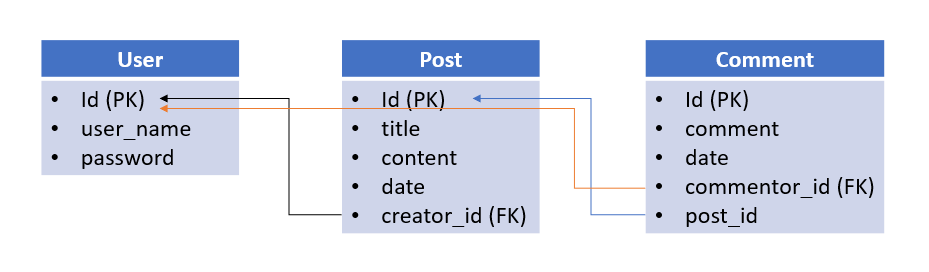
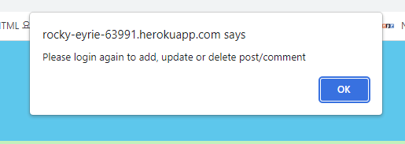
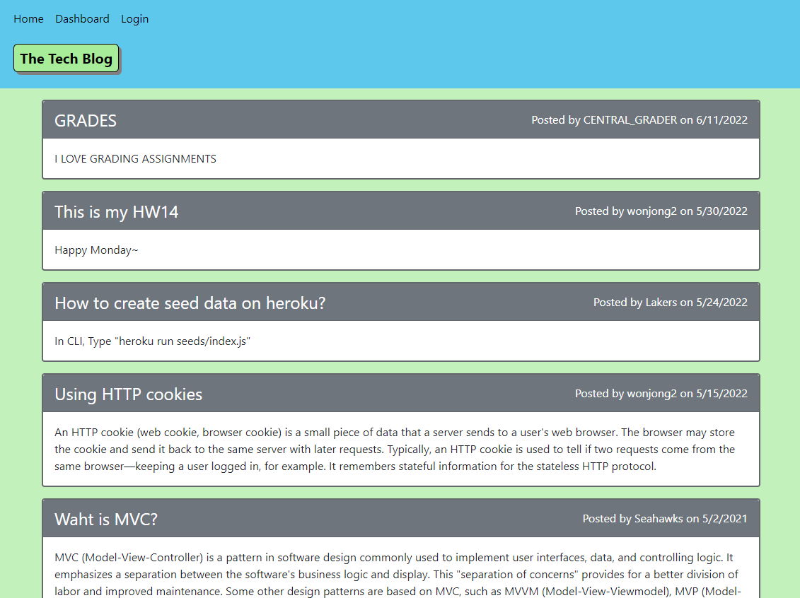

# Tech Blog

## Description

Build a CMS-style blog site, where developers can publish their blog posts and comment on other developers' posts as well. This application follows the MVC paradigm

-   Use node.js as a platform
-   Use express.js for the server operation
-   Use express-handlebars as the templating language
-   Use Sequelize and MySQL2(Dev)/JawsDB(Deploy) to interact with a MySQL DB
-   Use the express-session npm package for authentication
-   Use 'dotevn' to hide private information from public place
-   Schema to this project
    

`Deployed Application: ` https://tech-blog-wonjong.herokuapp.com/

## Table of Contents

1. [Installation](#installation)
2. [Usage](#usage)
3. [License](#license)
4. [Contributing](#contributing)
5. [Test](#test)
6. [Questions](#questions)

## Installation

On the command prompt :

1. At the db folder, create the database by using "source schema.sql" command
2. Move to the directory where server.js is
3. npm i
4. npm run seed
5. node server.js

## Usage

1. WHEN the user visits the site for the first time, THEN the user is presented with the homepage, which includes existing blog posts if any have been posted; navigation links for the homepage and the dashboard; and the option to log in
2. WHEN the user clicks on the homepage option, THEN the user is taken to the homepage
3. WHEN the user clicks on any other links in the navigation, THEN the user is prompted to either sign up or sign in
4. WHEN the user chooses to sign up, THEN the user is prompted to create a username and password
5. WHEN the user clicks on the sign-up button, THEN the user credentials are saved and the user is logged into the site
6. WHEN the user revisits the site at a later time and chooses to sign in, THEN the user is prompted to enter my username and password
7. WHEN the user is signed in to the site, THEN the user sees navigation links for the homepage, the dashboard, and the option to log out
8. WHEN the user clicks on the homepage option in the navigation, THEN the user is taken to the homepage and presented with existing blog posts that include the post title and the date created
9. WHEN I click on an existing blog post, THEN the user is presented with the post title, contents, post creator’s username, and date created for that post and has the option to leave a comment
10. WHEN the user enters a comment and clicks on the submit button while signed in, THEN the comment is saved and the post is updated to display the comment, the comment creator’s username, and the date created
11. WHEN the user clicks on the dashboard option in the navigation, THEN the user is taken to the dashboard and presented with any blog posts I have already created and the option to add a new blog post
12. WHEN the user clicks on the button to add a new blog post, THEN the user is prompted to enter both a title and contents for my blog post
13. WHEN the user clicks on the button to create a new blog post, THEN the title and contents of my post are saved and I am taken back to an updated dashboard with my new blog post
14. WHEN the user clicks on one of my existing posts in the dashboard, THEN the user is able to delete or update my post and taken back to an updated dashboard
15. WHEN the user clicks on the logout option in the navigation, THEN the user is signed out of the site
16. WHEN the user is idle on the site for more than a set time(currently 1 hour), THEN the user is able to view comments but the user is prompted to log in again before I can add, update, or delete comments like below
    

## License

Copyright (c) 2022 `wonjong2` (GitHub Username) Licensed under [the MIT License](https://choosealicense.com/licenses/mit/).

## Contributing

All your inputs are valuable and I love them.

-   Reporting a bug
-   Submiiting a fix
-   Proposing new features

## Test

N/A

## Questions

1. GitHub: https://github.com/wonjong2
2. If you have any questions, please reach out to wonjong2@gmail.com
